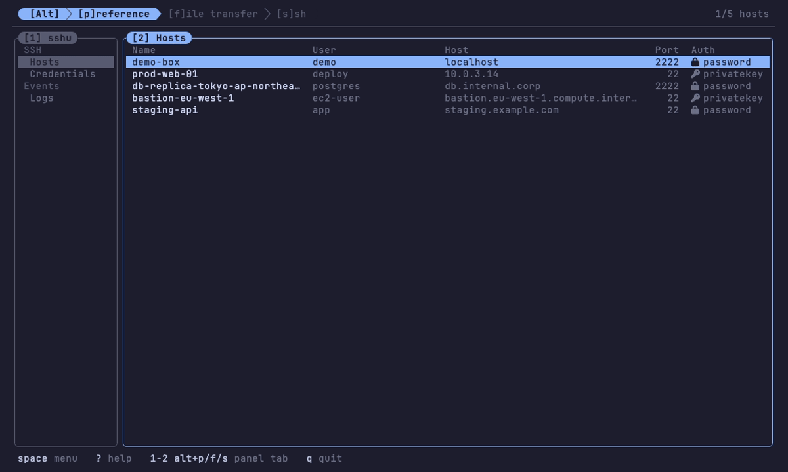
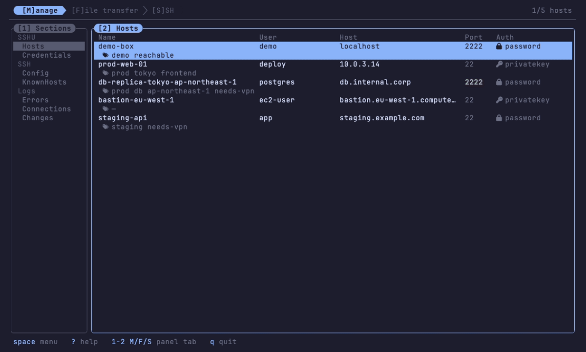
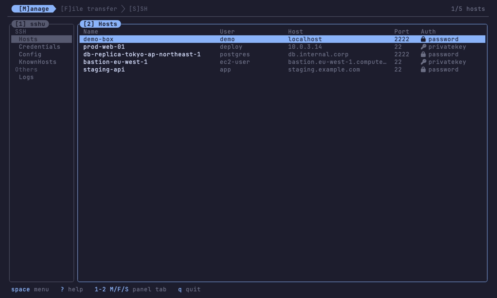

# sshu

<p align="center"></p>

[](https://github.com/vulcanshen/sshu/releases)
[](https://go.dev/)
[](LICENSE)

**語言**: [English](README.md) · 繁體中文

**ssh 與 sftp 的終端機前端** —— `Tab` / `Enter` / `Esc` / `Space` / `?` 驅動一切。host 收在一個檔案裡,想開幾個 shell 就開幾個,任兩台機器之間的檔案並排搬。不用背快捷鍵、不用設定、零學習成本。

> _不確定的時候,就按_ **`Space`**。

sshu 是 `u`-family 的成員,也是 [Vulcan's TUI Design Principle](https://github.com/vulcanshen/thoughts/blob/main/vtp.md) 在 ssh 領域的實作 —— 跟 [kbu](https://github.com/vulcanshen/kbu)(Kubernetes)、[filu](https://github.com/vulcanshen/filu)(filesystem)同一套設計系統。逐條對照的紀錄在 [`docs/sshu-implementation.md`](docs/sshu-implementation.md),背後的判斷過程(**包含試過而被否決的做法**)在 [`docs/sshu-ui-design.md`](docs/sshu-ui-design.md)。

靈感來自 [Termius](https://termius.com/) —— 一款 GUI 的 SSH client,而不是哪個終端機工具。sshu 借的是它的精神 —— hosts、sessions、檔案傳輸收在同一個屋簷下 —— 不是照單全收它的功能清單。

## Demo

### preference tab —— hosts、credentials、logs,然後連上去


### 雙側檔案傳輸 —— marks、真實傳輸、兼職進度條的分隔線


### ssh 網格 —— 格子、layout、按住 Alt 的方向鍵


## 五個鍵就能驅動 sshu

| 鍵 | 行為 |
|---|---|
| **`Tab`** | 移到當前 tab 的下一個 panel(在 ssh tab 上改為切換 session 格子的顯示) |
| **`Enter`** | 連線 / 進入目錄 / 確認選擇 |
| **`Space`** | *我在這裡能做什麼?* —— 當前 focus 的 contextual menu。也用來關掉任何浮層 |
| **`Esc`** | 退一層 —— 離開搜尋、回上層目錄、關掉最上面的浮層 |
| **`?`** | 全域說明 —— 所有跨 surface 的動作列在一起 |

tab 用 **`Alt+p` / `Alt+f` / `Alt+s`** 和絃切換 —— 是和絃,所以遠端拿著鍵盤時照樣有效(在 pty 裡用 shift 加大寫)—— 而裸數字 `1`–`9` 全部用來直達**當前 tab** 的 panel。

不確定就按 `Space`。字母快捷鍵是給熟了之後求快用的,而**每一個都同時是 `Space` menu 裡的一列** —— 所以除非你想背,否則沒有任何東西需要背。

## 三個 tab

```
 [Alt] ❯ [p]reference ❯ [f]ile transfer ❯ [s]sh
```

**`[Alt+p]reference`** —— 屬於 sshu 自己的一切,在同一個 nav 底下分類:**SSH**(Hosts、Credentials)、**Events**(Logs)。Hosts 是蓋在 `hosts.yaml` 上的表格,一列一台,終端機變窄就逐欄收起;`[A]dd` / `[E]dit` 打開帶即時驗證的表單,`Enter` 連線。credential 是可重用的身分(user + auth),host 用 `auth: credential` 整包引用。logs 是你沒在看的時候發生的一切,而且落地到磁碟 —— `[C]lear logs` 把它清空,連 `applogs.yaml` 一起。

**`[Alt+f]ile transfer`** —— 兩個各自獨立的檔案系統並排,1:1。`local` 開在你啟動 sshu 的目錄,所以 `cd ~/release && sshu` 一進去就在那批東西上。任一側可以是本機或某台已存的 host,而且**兩側都可以是遠端**,所以上傳、下載、遠端對遠端是同一個操作而不是三個。標記你要的、跨到另一邊、送出。傳輸進行時,右上角的 `<done>/<files> · <pct>%` 用綠色報告,tab 列下方那條分隔線同時兼職進度條 —— 綠色從左往右隨百分比推進,在每個 tab 都看得到,傳完瞬間恢復成普通的線。`/` 搜尋的是**整棵子樹**,不是螢幕上那個目錄;`v` 不用抓下來就能讀,`e` 直接用你自己的編輯器開。

**`[Alt+s]sh`** —— 一個**活終端機的網格**,每一格都是自己 PTY 上的真 `ssh`。session 清單上 `Tab` 切換格子上下網格、`Enter` 顯示並把鍵盤交過去、**按住 Alt 用方向鍵在格子間走**、`Alt+Esc` 把鍵盤收回來。游標掃過 session 清單時,對應的格子會在網格上跟著亮。layout 條紋決定排列:水平、垂直,或自訂的列 × 行。

## 安裝

> sshu **只支援 macOS / Linux** —— 它用 Unix PTY,沒有原生 Windows build。

**Homebrew**(macOS / Linux):

```bash
brew install vulcanshen/tap/sshu
```

**安裝腳本**(把最新 release binary 放進 `~/.local/bin`,root 則是 `/usr/local/bin`):

```bash
curl -fsSL https://raw.githubusercontent.com/vulcanshen/sshu/main/install.sh | sh
```

**從原始碼**:

```bash
go install github.com/vulcanshen/sshu/cmd/sshu@latest
```

或 clone 下來編:

```bash
git clone https://github.com/vulcanshen/sshu.git
cd sshu
make build     # → ./sshu   (CGO_ENABLED=0、-trimpath、已 strip)
./sshu
```

`Makefile` 包好了常用的事 —— `make build`、`make install`(→ `$GOBIN`)/ `make uninstall`、`make demo`(用 `demo/hosts.yaml` 跑,不碰你真正的設定)、`make package`(產 `dist/` 底下的 `.tar.gz`)、`make check`(fmt + vet + test)。直接跑 `make` 會列出全部。

**Nerd Font 是必要條件、不是選配**:auth 方式、檔案型別、marks 都用 Nerd Font glyph 畫,而且版面會去量它們的寬度。

### 移除

```bash
curl -fsSL https://raw.githubusercontent.com/vulcanshen/sshu/main/uninstall.sh | sh
```

移除 binary 後會**問過你**才碰設定目錄 —— `hosts.yaml` 和 `credentials.yaml` 都住在那裡,絕不擅自刪。

## 快速開始

```bash
sshu
```

開在 hosts 表格。按 `[A]` 加第一台 host,`Enter` 連線,`Alt+F` 切到檔案瀏覽器。第一次用的話,在任何 panel 上按 `Space` 讀一下那個 menu —— 它列的就是這個 panel 能做的全部。

## 你的資料放在哪

同一個目錄裡的幾個 YAML 檔,依這個順序解析:

| | |
|---|---|
| `$SSHU_CONFIG` | 直接指定目錄(`make demo` 和測試用的就是它) |
| `$XDG_CONFIG_HOME/sshu` | 有設就用 —— macOS 上也一樣,所以你可以不要 `~/Library/Application Support` |
| 都沒有 | `os.UserConfigDir()/sshu` |

`hosts.yaml` 放 host;`credentials.yaml` 放可重用的身分 —— 一個名字、一個 user、以及那個 user 怎麼驗證 —— host 用 `auth: credential` + `credential: <名字>` 整包拿走,「這條連線用誰」只寫在一個地方。`applogs.yaml` 是 app log 在磁碟上的脊椎。三個都是可以手改的 YAML,每次寫入都是原子的(暫存檔 + rename)並**重新確立 `0600`**。

### 設定 —— `config.yaml`

選用,放在同一個目錄,而且 **sshu 永遠不會寫它**:你手改過的檔案不會被重排,寫進去的註解也活得下來。檔案不存在就用預設值,所以它只需要寫你想改的那幾行。

```yaml
# 一次連線嘗試的預算,單位秒,預設 15。
# ssh tab 把它交給 ssh 當 -o ConnectTimeout;sftp 側拿它當 dial timeout。
connect_timeout: 15
```

超出 1–600 的值一律當成打錯,改用預設。設定檔壞掉不會擋著不讓 sshu 啟動 —— 它用預設值跑,並且在 app log 裡說出來。

### 密碼是明文存的 —— 請讀這段

`auth: password` 的 host 會把密碼**明文**放在 `hosts.yaml` 裡,`auth: password` 的 credential 在 `credentials.yaml` 裡也一樣。這是一個刻意的取捨,以下是配套:

- 檔案維持 `0600`,每次寫入重新確立,而且帶一段警告標頭
- 密碼永遠不會被畫出來 —— 表單顯示的是 `••••`
- 用 `SSH_ASKPASS` 把它交給 `ssh`,所以這個祕密**不會進到子行程的環境變數**,也不會出現在 `ps`

`0600` 撐不過「被複製進備份、dotfiles repo 或同步資料夾」。如果你在意這件事,請用 `auth: privatekey` —— 它只存一條路徑。keychain 撐腰的 `secretStore` 是規劃中的替代方案。

### Host key

ssh tab 是把真的 `ssh` 執行檔叫起來,所以那邊的 host key 處理就是 OpenSSH 的,連同你的 `~/.ssh/config` 和 `known_hosts`。

file transfer tab 自己講協定,而它的政策更嚴:**未知的 host 直接拒絕**而不是放行,**變過的 key 直接拒絕**而且不會拿出來當問題問你。要接受一台新的機器,先用 ssh tab 連一次 —— 那是 OpenSSH 的提示,用 OpenSSH 的指紋。

## 按鍵

底下每一個字母快捷鍵,同時都是那個 panel 的 `Space` menu 裡的一列。**方括號印的大小寫就是你要按的那個鍵**:`[A]dd` 是 shift+A、`[t]ransfer` 是裸的 `t`,沒有標出來的東西不會動。

### 到處都通

```
 tab       Alt+p / Alt+f / Alt+s(pty 裡:shift 加大寫)
 panel     當前 tab 的 1–9  ·  Tab(ssh tab:顯示開關)
 游標      j k    u d(半頁)          gg G      方向鍵同義
 全域      Space menu    ? help    q 離開    Ctrl+C 強制離開
```

### `[Alt+p]reference`

左側 nav(`1`)選條目 —— **Hosts**、**Credentials**、**Logs**,分在 SSH / Events 兩個 header 底下,游標會直接跳過 header —— 內容跟著游標換;`Enter` 或 `2` 把鍵盤移到內容上。鍵盤一交出去,整片 nav 就暗下來變成「`[2]` 在顯示什麼」的圖例;唯一還亮著的是未讀錯誤數。

| 鍵 | 動作 |
|---|---|
| `Enter` | hosts:連線(先問;credential host 在這一步就解析)· credentials:編輯 |
| `A` | 新增 host / credential |
| `E` | 編輯游標這一台 |
| `D` | 刪除(先問 —— 刪 credential 會數還有幾台 host 引用它) |
| `/` | hosts:搜尋 —— name / user / host / port 一起比對,依分數排序 |
| `C` | logs:清空 log(先問 —— 連 `applogs.yaml` 一起清) |

表單裡:`Tab` / `Shift+Tab` / `↑` `↓` 換欄位;`←` `→` 切 Auth(password / privatekey / **credential**)。兩個「選值欄位」—— IdentityFile 與 Credential —— **空欄按 `Enter` 開選單、有值按 `Enter` 跳下一欄、`Backspace` 整行清除**。選了 `credential`,User 列會變暗:user 由 credential 供應。

### `[Alt+f]ile transfer` —— 小寫是游標那一列,大寫是整個 panel

| 鍵 | 動作 |
|---|---|
| `h` `l` | 跨到另外半邊,保持同一列(`[2]`↔`[4]`) |
| `Enter` | 進入游標所在的目錄 —— 或前往搜尋找到的那個東西 |
| `a` | **Append to marks** —— 再按一次就把 mark 拿掉 |
| `r` | 就地改名 |
| `v` | **讀它** —— 文字帶語法上色與行號,二進位轉 hex,目錄列出內容 |
| `e` | 用 `$EDITOR` **編它** —— 抓下來、編、寫回去 |
| `t` | 傳到另一側的當前目錄 |
| `x` | 刪掉(先問) |
| `/` | **搜尋整棵子樹** —— `Enter` 帶你到結果所在的位置、游標停在它上面,`a` / `t` / `v` / `e` / `x` 從那裡全部能用 |
| `A` | **新增** —— `name` 建空檔,`name/` 建目錄 |
| `T` | 傳這一側全部的 marks |
| `X` | 刪這一側全部的 marks(先問) |
| `c` / `C` | 清一個 mark(在 marks panel 上)/ 清空全部 —— 只是忘記它們,磁碟上什麼都不動 |
| `S` | 選 host —— `local` 排第一,而且開在**你啟動 sshu 的那個目錄** |
| `P` | 進度 —— 進行中的傳輸,可逐條取消 |

### `[Alt+s]sh`

| 鍵 | 動作 |
|---|---|
| **`Tab`** | **切換這個 session 的格子**上下網格 —— 同時顯示幾個都行 |
| `Enter` | 顯示這個 session **並把鍵盤交給它**(側欄同時收起) |
| `C` | 關掉這個 session(先問) |
| `D` | 複製 —— 對同一台再開一個 session(先問) |
| **`Alt+方向鍵`** | 往那個方向的鄰格移動 —— 空間移動,不用記編號、重排無感 |
| **`Alt+Esc`** | **從遠端手上把鍵盤收回來** —— 回到清單,側欄回來 |

layout 條紋(`2`,在左欄底部 —— 右側整片留給終端機)決定網格排列:`j`/`k` 在**水平 / 垂直 / 自訂**之間走、走到就生效;在自訂上按 `Enter` 問**列 × 行**(兩個 1–9 的數字,先列後行)。列上一行寫完 `<user>@<host>:<port>`,ssh 自己的拼法,開頭是顯示欄 —— 有格子的是 monitor glyph、沒有的是劃線的那個。游標移動時,對應格子的外框在網格上同步亮 —— 這一列和那一格本來就是同一個 session,所以一起亮。

`Alt+Esc` 是 sshu 自己的鍵,只為一個情況存在:網格的格子把每一個按鍵都交給遠端,所以總得有東西能把它收回來。其他地方,單純的 `Esc` 就夠了。

## 特色

- **零學習成本** —— 每一個動作都在 `Space` menu 裡、依當下情境、每個 panel 都有。menu 和字母快捷鍵是同一張表產生的,所以「menu 裡沒有的快捷鍵」不可能存在。
- **menu 分兩區** —— `item`(對游標那一列做什麼,標題就是那一列)和 `panel`(對這一側做什麼)。只有一區的時候維持扁平。
- **並存 ssh session 的網格** —— 每一個都是 embedded PTY 裡的真 `ssh`,同時上畫面幾個都行,水平、垂直或自訂列 × 行排列。每一格的遠端只在尺寸真的變了才收到通知。結束的 session 立刻離開網格並放掉模擬器;鍵盤絕不會默默落進另一台遠端。
- **可重用的 credential** —— 一個 user 加上他怎麼驗證,存一次在 `credentials.yaml`,任意數量的 host 用 `auth: credential` 引用。解析發生在門口:連線確認框顯示的就是實際要用的身分,斷掉的引用在那一步就用一句話失敗,不會走進 ssh 裡才爆。
- **兩側對等的 sftp** —— local ↔ remote ↔ remote 走同一個 `FS` 介面。marks 是分側的;一個 mark 是一條絕對路徑,所以改名它會跟著走,刪掉它會被拿掉。
- **遞迴子樹搜尋** —— `/` 走遍當前目錄底下整棵樹,**廣度優先**(SFTP 上每一層目錄都是一次 round trip,所以近的先到),串流、可取消、有上限,而且**就地畫出來**。`Enter` 把你帶到結果所在的位置、游標已經停在它上面,從那裡標記它、傳它,不需要學任何新東西。
- **抓下來之前先讀** —— `v` 顯示游標那一項:文字帶語法上色與行號(chroma + catppuccin-mocha,跟 filu 同一套),二進位是 xxd 風格的 hex dump,目錄是它的第一層列表。最多讀 64 KiB,因為在遠端那一側每一個 byte 都要過網路。檔案裡的跳脫序列會被剝掉:那些 bytes 是從別人的機器上來的,不處理的話會重畫你的終端機。
- **用你自己的編輯器編** —— `e` 用 `$VISUAL` / `$EDITOR` 打開游標那一項(`vi` 只是地板,不是依賴),跑在 embedded terminal 裡所以框還在。遠端的檔案抓下來、編、寫回去;本機的檔案就地編,所以它的 inode —— 以及指向它的每一個 hard link —— 都還在。內容沒有真的變就不會寫回去;寫入是原子的,斷線不會留下一份被截斷的設定檔;而在你開著它的時候被別人改過的檔案,絕不會不問一聲就蓋掉。
- **真的傳輸引擎** —— 整個 plan 在動手之前就算完,所以進度條的分母從第一格就是對的,而覆寫在一開始就一次問完。可逐條取消;取消或失敗的檔案會被移除,而不是留在那裡看起來像完成了。
- **目錄保持最新,而且很便宜** —— SFTP 沒有變更通知,所以 sshu 去 stat 目錄、比對 mtime,只有動了才重新列。每隔幾秒一次很小的 round trip,而不是整份重列,而且只在這個 tab 在畫面上的時候做。
- **還沒接通的連線會說自己在連** —— 格子畫的是 PTY,而 ssh 等 TCP 的時候什麼都不印,所以連不上的主機以前就是一個空框、空到作業系統放棄為止。判準是**對面有沒有送出過 byte**,不是網格空不空:在那之前,panel 會說出對方是誰、以及等了幾秒。
- **沒有東西會無聲死掉,也沒有東西只講一次** —— 不正常結束的 session 會跳 toast,說是哪一台、以及 **ssh 自己說了什麼**(`Connection refused`,不是 `disconnected`);網格會留著那句話而不是變回空框;app log 保存的是**整個最終畫面** —— 連線被拒是一行,但 host key 不符是十五行,而你要的指紋在中間。log 住在 preference → logs,**落地到 `applogs.yaml`**,重開 app 還在;而且記的不只失敗:host 與 credential 的增刪改、連線的開與關、傳輸的結果、edit 的寫回。nav 與 footer 掛著你還沒讀的錯誤數,看到為止。
- **任何離開方式都不留孤兒** —— 每個 ssh 子行程都在自己的 PTY session 上,訊號自己到不了它。一個 registry 認得它們全部,而每一條出路 —— `q`、`Ctrl+C`、外部的 SIGINT/SIGTERM、甚至關掉終端機視窗(SIGHUP)—— 都會順路帶走它們。
- **frame 不變量** —— 每一條畫出來的線都剛好是終端機的寬度,任何尺寸、任何內容。從遠端來的寬字元、量起來不一樣的 Nerd Font glyph、CJK 檔名,全部靠「量」而不是「猜」;而且有一個測試橫跨尺寸、focus 狀態與資料在檢查它。
- **unix-first、靜態執行檔** —— macOS + Linux;`CGO_ENABLED=0`。

## 現況

**v0.1.1。** 三個 Alt 和絃 tab、分類的 `[1] sshu` nav、可重用的 credentials、落地的 app log、ssh 終端網格,以及不留孤兒的行程收尾。300+ 個測試,`make check` 綠、`-race` 乾淨。見 [CHANGELOG.md](CHANGELOG.md)。

還沒有的:
- **sftp 側未知 host key 的互動確認** —— 今天是直接拒絕,要先用 ssh tab 接受
- **sftp 側的加密私鑰** —— 會如實回報,但還不能用;agent 支援是可能的解法
- 遠端內容搜尋(那需要在對面跑指令,而這個 tab 刻意不做這件事)
- hosts 表格的 `[S]ftp` 捷徑,把游標那一台直接接到檔案瀏覽器 focus 的那一側
- 滑鼠、`hosts.yaml` 的 `fsnotify` reload、session 保存、keychain 撐腰的密碼儲存

## 用什麼做的

Go、[Bubble Tea](https://github.com/charmbracelet/bubbletea) 與 [Lip Gloss](https://github.com/charmbracelet/lipgloss),embedded terminal 用 [creack/pty](https://github.com/creack/pty) + [hinshun/vt10x](https://github.com/hinshun/vt10x),檔案傳輸用 [pkg/sftp](https://github.com/pkg/sftp) + `golang.org/x/crypto/ssh`,`v` 的語法上色用 [chroma](https://github.com/alecthomas/chroma)。配色是 catppuccin-mocha。
