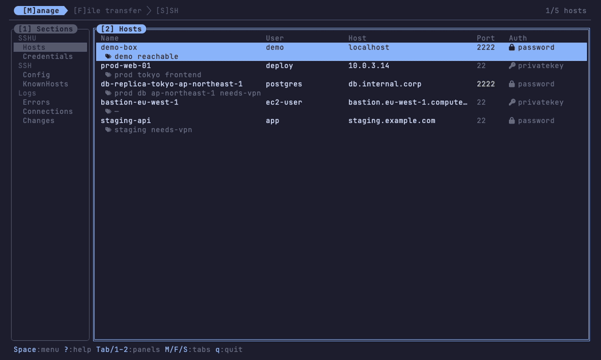

# sshu

<p align="center"></p>

[](https://github.com/vulcanshen/sshu/releases)
[](https://go.dev/)
[](LICENSE)
[](https://github.com/charm-and-friends/charm-in-the-wild#networking-and-file-transfer)

**語言**: [English](README.md) · 繁體中文

**ssh 與 sftp 的終端機前端** —— `Tab` / `Enter` / `Esc` / `Space` / `?` 驅動一切。host 收在一個檔案裡,想開幾個 shell 就開幾個,任兩台機器之間的檔案並排搬。在 server 上也裝一份,它就會巢狀 —— sshu 裡面的 sshu,幾層都行,而且沒有任何一層會吃掉你一列畫面。不用背快捷鍵、不用設定、零學習成本。

> _不確定的時候,就按_ **`Space`**。

靈感來自 [Termius](https://termius.com/) —— hosts、sessions、檔案傳輸收在同一個屋簷下 —— 只是搬進了終端機。

## Demo



ssh 網格:一個畫面上好幾個活的 session,每一格都是真的 `ssh`。

## 特色

- **不用背任何東西** —— 在任何 panel 上按 `Space`,列出來的就是這裡能做的全部。每一個字母快捷鍵也都是那個 menu 裡的一列。
- **活 ssh session 的網格** —— 每一格都是自己終端機上的真 `ssh`,同時開幾個都行,可以水平、垂直或自訂欄數排列。`PgUp` / `PgDown` 翻回這個 session 的歷史。
- **用鍵盤從 session 裡複製** —— `Alt+v` 凍結一格,用 vim 的鍵選字,`y` 放進系統剪貼簿。
- **任兩台機器之間傳檔** —— 本機 ↔ 遠端 ↔ 遠端,同一個畫面。可以搜尋整棵子樹、不抓下來就先讀檔,或直接用你自己的 `$EDITOR` 打開、改完自動寫回去。
- **sshu 裡面再開 sshu,幾層都行** —— 在 server 上也裝一份就好。`Alt+Z` 讓一格佔滿整個畫面、連 sshu 自己的框都不畫,`Alt+Enter` 把鍵盤一路往內層傳,所以多一層不多花任何畫面。
- **就地管理你的 `~/.ssh` 檔案** —— 瀏覽、編輯 `~/.ssh/config` 與 `~/.ssh/known_hosts`,註解一行都不會掉。`auth: sshconfig` 的 host 什麼都不存,全部交給 `~/.ssh/config` 決定 —— ProxyJump、agent、金鑰都算在內。
- **可重用的 credential** —— 一個 user 和它的驗證方式定義一次,任意數量的 host 都能引用。
- **tag** —— 你自己下在 host 上的字,`/` 搜得到:打 `prod`,整群就出來了。
- **看得懂的失敗** —— 不正常結束的 session 會說出 ssh 自己講了什麼,完整輸出留在 manage → Errors;旁邊還有每一次連線、每一筆你改過的東西的紀錄。
- **密碼在磁碟上是加密的** —— 而且從不顯示、也不經過環境變數。

## 安裝

> sshu **只支援 macOS / Linux** —— 它用 Unix PTY,沒有原生 Windows build。

**Homebrew**(macOS / Linux):

```bash
brew install vulcanshen/tap/sshu
```

**安裝腳本**(把最新 release binary 放進 `~/.local/bin`,root 則是 `/usr/local/bin`):

```bash
curl -fsSL https://raw.githubusercontent.com/vulcanshen/sshu/main/install.sh | sh
```

從原始碼建置見 [`docs/dev-remarks.md`](docs/dev-remarks.md)。

### 需求

- **Nerd Font** —— 必要,不是選配:auth 方式、檔案型別、marks 都用 Nerd Font glyph 畫。
- **truecolor 終端機**(24-bit 色)—— 配色裡的淡色、popup 的層色,以及 popup 底下變暗的畫面,在 256 色下都分不出來。
- **會送出 Alt 的終端機** —— sshu 的 `Alt+…` 鍵(離開 session 的 `Alt+Esc`、`Alt+v`、`Alt+Z` ……)需要 Option 鍵當 Meta 用。macOS 內建的 Terminal 要開「Use Option as Meta key」,iTerm2 要把 Option 設成 *Esc+*;kitty、Alacritty、WezTerm 預設就會送。

### 移除

```bash
curl -fsSL https://raw.githubusercontent.com/vulcanshen/sshu/main/uninstall.sh | sh
```

移除 binary 後,會先問過你才碰設定目錄 —— 你的 host 和 credential 都在那裡。

## 快速開始

```bash
sshu
```

一打開就是 hosts 表格。按 `A` 加第一台 host,`Enter` 連線,`F` 切到檔案傳輸。不知道下一步要做什麼,就按 `Space`。

## 五個鍵就能驅動 sshu

| 鍵 | 行為 |
|---|---|
| **`Tab`** | 移到當前 tab 的下一個 panel(manage 與 file transfer;ssh tab 用 `1` `2`) |
| **`Enter`** | 連線 / 進入目錄 / 確認選擇 |
| **`Space`** | *我在這裡能做什麼?* —— 當前 focus 的 menu;最後一列打開全域動作(切 tab、離開)。再按一次關掉 menu |
| **`Esc`** | 退一層 —— 離開搜尋、回上層目錄、關掉最上面的浮層 |
| **`?`** | 這個 panel 能按的鍵,接著是到處都能用的鍵。在浮層上:那個浮層自己的按鍵 |

用 **`M` / `F` / `S`** 切 tab;數字 `1`–`9` 直達當前 tab 的 panel。在遠端 session 裡打字時,每一個鍵都屬於遠端 —— 按 `Alt+Esc` 把鍵盤收回來。

## 三個 tab

```
 [M]anage ❯ [F]ile transfer ❯ [S]SH
```

**`[M]anage`** —— sshu 知道的一切,分成三類:

- **SSHU** —— **Hosts**(蓋在 `hosts.yaml` 上、可搜尋的表格;`A` 新增、`E` 編輯、`Enter` 連線)與 **Credentials**(host 可以引用的共用身分)。
- **SSH** —— **Config**(`~/.ssh/config`,一列一個 `Host` 區塊,`Include` 會跟進去;編一個區塊只動它自己的那幾行)與 **KnownHosts**(`~/.ssh/known_hosts`;先拿到某台機器的金鑰、看過指紋再決定要不要信任,或刪掉過時的那一筆)。
- **Logs** —— **Errors**(出了什麼事;`Enter` 看遠端印出來的全部內容)、**Connections**(每一次 ssh 和 sftp 連線)、**Changes**(你改過什麼);後兩本按 `Enter` 開整本,每一筆完整顯示。三本可以各自清空。

**`[F]ile transfer`** —— 左右兩側,各自可以是本機或某台已存的 host,所以上傳、下載、遠端對遠端都是同一個操作。標記檔案、跨到另一邊、送出。`local` 開在你啟動 sshu 的目錄,所以 `cd ~/release && sshu` 一進去就在那批東西上。進度顯示在右上角,tab 列下方也有一條進度條。

**`[S]SH`** —— 活終端機的網格。在 session 上按 `Enter` 把鍵盤交給它,`Alt`+方向鍵在格子間移動,`Alt+Z` 放大焦點格,`Alt+Esc` 把鍵盤收回來。layout 條紋選水平、垂直或指定欄數。

## 按鍵

底下每一個字母快捷鍵,同時都是那個 panel 的 `Space` menu 裡的一列。**方括號印的大小寫就是你要按的那個鍵**:`[A]dd` 是 shift+A、`[t]ransfer` 是裸的 `t`。

### 到處都通

```
 tab       M / F / S(session 裡:它們屬於遠端)
 panel     當前 tab 的 1–9  ·  Tab(manage、file transfer)
 游標      j k    u d(半頁)          gg G      方向鍵同義
 全域      Space menu    ? help    q 離開    Ctrl+C 離開(按兩次:立刻走)
           (session / 編輯器裡 Ctrl+C 屬於它們 —— 先 Alt+Esc)
```

### `[M]anage`

左側 nav(`1`)選條目,內容跟著游標換;`Enter` 或 `2` 把鍵盤移到內容上。

| 鍵 | 動作 |
|---|---|
| `Enter` | 唯讀看這一列的全部內容 —— 密碼一律遮起來。在 host 上,底下會問要不要連線,再按一次 `Enter` 就連進去。在 Errors 上:看完整輸出 |
| `A` | 新增 host / credential / `~/.ssh/config` 的 block / known_hosts 的 key(先向 host 要 key,看過再決定) |
| `E` | 編輯游標這一列 |
| `D` | 複製 host、credential 或 `~/.ssh/config` 的 block —— 開一個從這一列預先填好的新增表單,換個名字就能存 |
| `X` | 刪除(先問) |
| `/` | 搜尋 host —— name、user、host、port、tags 一起比對 |
| `C` | Errors / Connections / Changes:清空這一本(先問) |

host 表單裡:`Tab` / `Shift+Tab` / `↑` `↓` 換欄位,`←` `→` 在 **password**、**privatekey**、**credential**、**sshconfig** 之間切 Auth。`Enter` 就是存檔;有必填沒填或填錯的,它會帶你到第一個有問題的欄位,並說出哪裡不對。**Tags** 選填,用空白分隔。

### `[F]ile transfer` —— 小寫作用在游標那一列,大寫作用在整個 panel

| 鍵 | 動作 |
|---|---|
| `h` `l` | 跨到另一側 |
| `Enter` | 進入目錄 —— 或前往搜尋結果 |
| `a` | 標記 / 取消標記 |
| `r` | 改名 |
| `v` | 檢視 —— 文字帶語法上色,二進位轉 hex,目錄列出內容 |
| `e` | 用 `$EDITOR` 編輯 —— 遠端的檔案會抓下來、改完寫回去 |
| `t` | 傳到另一側的當前目錄 |
| `x` | 刪除(先問) |
| `/` | 搜尋整棵子樹 |
| `A` | 新增 —— `name` 建檔案,`name/` 建目錄 |
| `R` | 重讀這個目錄 |
| `T` | 傳這一側全部的標記 |
| `X` | 刪這一側全部的標記(先問) |
| `c` / `C` | 清一個標記 / 清掉全部(磁碟上什麼都不動) |
| `H` | 選這一側的 host(`local` 排第一) |
| `D` | 這一側斷線 |
| `J` | Jobs —— 進行中的傳輸;`Enter` 看那一條的全文,`c` 取消 |

傳輸進行中 `H` 和 `D` 會變暗、按了沒有反應 —— 先到 `J` 取消。

### `[S]SH`

| 鍵 | 動作 |
|---|---|
| `H` | 把這個 session 的格子從網格上拿掉,或放回去 |
| `Enter` | 顯示這個 session 並把鍵盤交給它 |
| `C` | 關掉這個 session(先問)—— 「全部關掉」在 `Space` menu 裡 |
| `D` | 對同一台再開一個 session(先問) |
| `PgUp` / `PgDown` | 翻這一格的歷史(打字就回到即時畫面) |
| `Alt+Z` | 分階段放大:佔滿網格區、再佔滿整個畫面、再回到原樣 |
| `Alt+Enter` | Lock / release —— 巢狀 sshu 用:把每一個鍵都傳給內層那一個 |
| `Alt+方向鍵` | 移到那個方向的鄰格 |
| `Alt+Esc` | 退一步 —— 先離開選取模式,再退出放大,最後把鍵盤收回來 |
| `Alt+v` | 選取模式 —— 凍結這一格,從裡面複製 |

**選取模式**(`Alt+v`)用 vim 的鍵:

| 鍵 | 動作 |
|---|---|
| `h` `j` `k` `l` | 移動(超過上下邊界時,凍結的頁面會跟著捲) |
| `w` / `e` / `b` | 下一個 word 開頭 / word 結尾 / 上一個 word 開頭 |
| `0` / `$` | 列首 / 列尾 |
| `u` / `d` | 往上 / 往下半個畫面 |
| `v` / `V` | 依字元 / 依整行選取 |
| `y` | 複製到系統剪貼簿並離開(什麼都沒選:游標那一行) |
| `Esc` | 先丟掉選取,再離開 |
| `?` | 這個模式所有的鍵 |

複製靠 `pbcopy`、`wl-copy`、`xclip` 或 `xsel`,有裝哪個就用哪個。

layout 條紋(`2`,左下角):`j` / `k` 在**水平**、**垂直**、**自訂**之間切換;在自訂上按 `Enter` 輸入欄數。

## 設定

### 你的資料放在哪

sshu 所有的檔案都在同一個目錄:

| | |
|---|---|
| `$SSHU_CONFIG` | 有設就用這個目錄 |
| `$XDG_CONFIG_HOME/sshu` | 有設就用 —— macOS 上也一樣 |
| 都沒有 | `os.UserConfigDir()/sshu`(macOS 是 `~/Library/Application Support/sshu`,Linux 是 `~/.config/sshu`) |

| 檔案 | 內容 |
|---|---|
| `hosts.yaml` | 你的 host |
| `credentials.yaml` | 可重用的身分 —— 一個名字、一個 user、以及它怎麼驗證;host 用 `auth: credential` + `credential: <名字>` 引用 |
| `config.yaml` | 設定(選用,見下方) |
| `errors.yaml` · `connections.yaml` · `changes.yaml` | 三本紀錄 |
| `.sshukey` | 加密密碼用的鑰匙 |

全部都是可以手改的 YAML,權限維持 `0600`。

### 設定 —— `config.yaml`

選用;sshu 只讀不寫,所以你的註解和排版都不會被動到。沒寫的項目用預設值。

```yaml
# 一次連線嘗試的時間上限,單位秒(1–600),預設 15。
connect_timeout: 15
```

### 密碼

存起來的密碼用 AES-256-GCM 加密,所以 `password:` 那一欄是 `ENC:…`。鑰匙是同一個目錄裡的 `.sshukey`,第一次啟動時自動產生;想放到別處,設 `SSHU_KEY_FILE`。

|  |  |
|---|---|
| **擋得住** | 只有 `hosts.yaml` 或 `credentials.yaml` 流出去 —— 貼到聊天室、不小心 commit、被備份掃走 |
| **擋不住** | 整個設定目錄被複製走,因為**鑰匙就在裡面**;以及任何以你的身分在跑的其他程式 |

所以**設定目錄不要進版控、不要放進同步資料夾、不要讓備份掃到。** 想連「整個目錄被複製」都擋住,就用 `SSHU_KEY_FILE` 把鑰匙放到別的地方 —— 但那把鑰匙得你自己備份,鑰匙掉了,存起來的密碼就全部跟著沒了。

密碼從不顯示在畫面上,交給 `ssh` 的方式是 `SSH_ASKPASS`,不會經過環境變數或命令列。如果你根本不想讓 sshu 存密碼,用 `auth: privatekey`(只存一條路徑)或 `auth: sshconfig`(什麼都不存)。

### Host key

- **ssh tab** —— 執行的是真的 `ssh`,所以 host key 由 OpenSSH 處理,用的是你的 `~/.ssh/config` 和 `known_hosts`。
- **file transfer tab** —— 未知的 host、變過的 key 都直接拒絕,不會問你。要接受一台新機器,先從 ssh tab 連一次,或在 manage → KnownHosts 按 `A`。(`auth: sshconfig` 的 host 在這裡也走真的 `ssh`,問的是 OpenSSH 自己的提示。)

## 已知限制

- file transfer tab 無法對 password、privatekey、credential 的 host 互動確認未知的 host key —— 先從 ssh tab 接受它。
- file transfer tab 上,`privatekey` host 不能用有 passphrase 的私鑰;改用 `auth: sshconfig` 的 host,它走 `ssh` 和 agent。
- 不能搜尋遠端檔案的內容。
- 沒有滑鼠支援、`hosts.yaml` 在磁碟上改了不會自動重讀、不保存 session、密碼不存進 keychain。

## 相關連結

- [CHANGELOG.md](CHANGELOG.md) —— 每一版改了什麼
- [`docs/dev-remarks.md`](docs/dev-remarks.md) —— 開發者備忘:運作方式、設計理由、設計文件導讀、建置與測試

## terminu family

sshu 遵循 [terminu design principle](https://github.com/vulcanshen/terminu/tree/v0.1.17/principle):跟家族其他成員同一套按鍵、同一種 menu —— [kbu](https://github.com/vulcanshen/kbu)(Kubernetes)、[filu](https://github.com/vulcanshen/filu)(檔案)、[webu](https://github.com/vulcanshen/webu)(網頁)與 [locku](https://github.com/vulcanshen/locku)(螢幕鎖)。

## License

[GPL-3.0](LICENSE)
