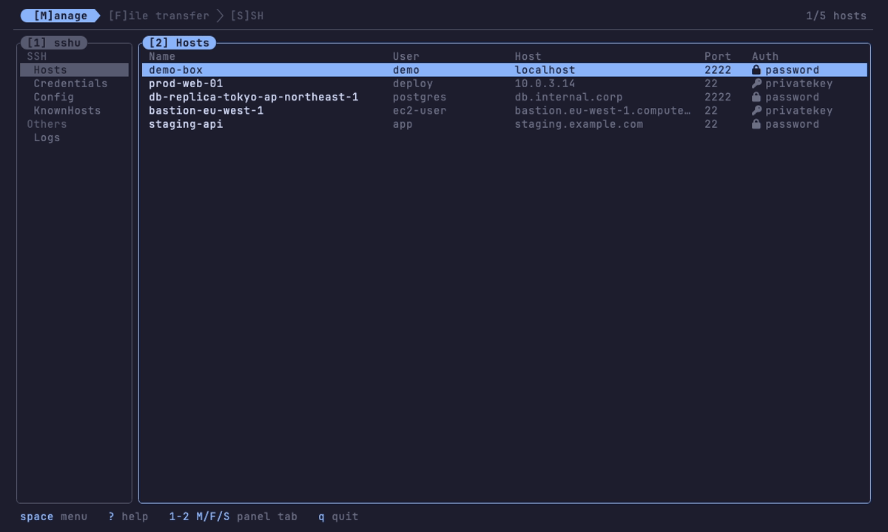
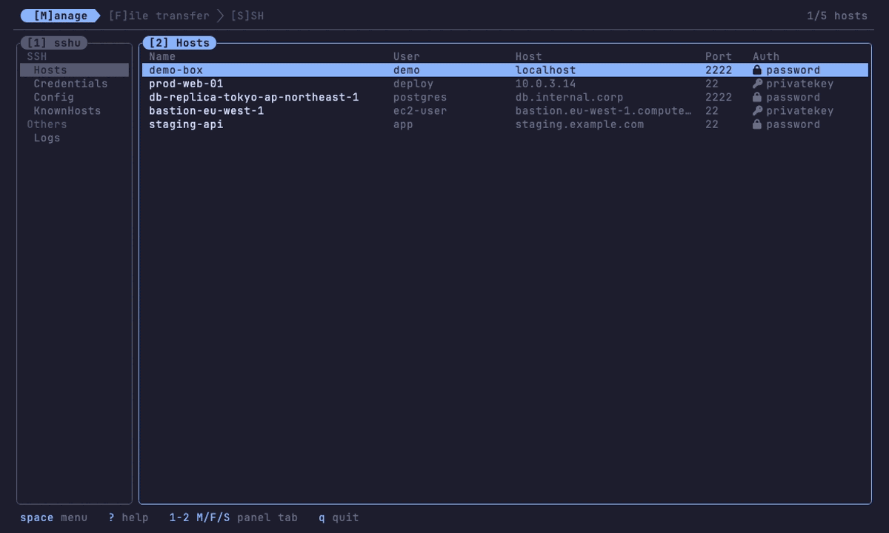

# sshu

<p align="center"></p>

[](https://github.com/vulcanshen/sshu/releases)
[](https://go.dev/)
[](LICENSE)
[](https://github.com/charm-and-friends/charm-in-the-wild#networking-and-file-transfer)

**Language**: English · [繁體中文](README-zh_TW.md)

**A terminal front end for ssh and sftp** — `Tab` / `Enter` / `Esc` / `Space` / `?` drive everything. Keep your hosts in one file, open as many shells as you like, and move files between any two machines side by side. Install it on the server too and it nests — sshu inside sshu, at any depth, with no layer costing you a row of screen. No hotkey memorization, no setup, no learning curve.

> _When in doubt, hit_ **`Space`**.

sshu is a member of the `u`-family and an ssh-domain implementation of [this TUI Design Principle](https://github.com/vulcanshen/thoughts/blob/main/tui-design/README.md) — the same design system as [kbu](https://github.com/vulcanshen/kbu) (Kubernetes) and [filu](https://github.com/vulcanshen/filu) (filesystem). See [`docs/sshu-implementation.md`](docs/sshu-implementation.md) for the clause-by-clause record, and [`docs/sshu-ui-design.md`](docs/sshu-ui-design.md) for the reasoning behind it — including the approaches that were tried and rejected.

The inspiration is [Termius](https://termius.com/) — a GUI SSH client, not another terminal tool. sshu borrows its spirit — hosts, sessions and transfers under one roof — not its feature list.

## Demo

### The manage tab — seven sections in three groups, a failure opened in full, and a connect


### Two-sided file transfer — marks, a real transfer, the rule as its progress bar


### The ssh grid — cells, layouts, held-Alt arrows


### sshu inside sshu — the whole chain, driven from the outermost layer


## Five keys to drive sshu

| Key | Behavior |
|---|---|
| **`Tab`** | Move focus to the next panel of this tab (on the ssh tab it toggles a session's cell instead) |
| **`Enter`** | Connect / enter a directory / commit a choice |
| **`Space`** | *What can I do here?* — the contextual menu for whatever has focus. Also closes any popup |
| **`Esc`** | Back out — leave a search, go up a directory, close the top popup |
| **`?`** | Global help — the whole key vocabulary in one list, including the grid keys you cannot ask about from inside a cell |

Tabs are switched with a single shifted letter — **`M` / `F` / `S`** — and every bare digit `1`–`9` addresses a panel of the current tab. Inside a pty the letters belong to the remote like every other bare key: `Alt+Esc` takes the keyboard back first.

When in doubt, press `Space`. Letter hotkeys exist for speed, and every one of them is also a row in the `Space` menu — so there is nothing you have to memorize unless you want to.

## The three tabs

```
 [M]anage ❯ [F]ile transfer ❯ [S]SH
```

**`[M]anage`** — sshu's own data and the two `~/.ssh` files it edits, under one nav in three groups: **SSHU** (Hosts, Credentials — files sshu owns and writes), **SSH** (Config, KnownHosts — files ssh owns, which sshu only reads and edits in place), and **Logs** (Errors, Connections, Changes). Hosts are a table over `hosts.yaml`, two lines each — the row, and your own tags under it — shedding columns as the terminal narrows; `[A]dd` / `[E]dit` open a form with live validation, `Enter` connects. Tags are yours: space separated, never interpreted, and searchable with `/`, so `prod` pulls up the group at once. The one colour on a row marks a port that is not 22. Credentials are reusable identities (user + auth) that hosts can reference with `auth: credential`. A fourth kind, `auth: sshconfig`, stores nothing at all: sshu sends the destination and lets `~/.ssh/config` answer for the rest — key, agent, ProxyJump — and whatever ssh asks for on the way in is asked of you when ssh asks it. **Config** is `~/.ssh/config` itself — the file tab `[3]` is already reading, since sshu launches the real `ssh` — listed one `Host` block per row — `Include` followed, so the list spans every file the tree really has — with a form that carries whatever keywords that block happens to use. Editing one changes only its own lines: comments, `Match` blocks and keywords sshu has never heard of come through untouched. A host's own detail says what this file will do to it — the union of every matching block, first value winning, with the ones sshu's command line overrides marked. **KnownHosts** is `~/.ssh/known_hosts` — the file that decides whether you are talking to the machine you meant, and the one sshu already refuses connections over when a key has changed. `[X]` is the way out of that refusal; `[A]` asks a host for its key, stops before authenticating, and shows you the fingerprint before writing anything. **Logs** is three records rather than one, because one log was answering three questions at once. **Errors** is what went wrong — one row each (time, host, user, cause), and `Enter` opens everything the far end printed, which for a host key mismatch is fifteen lines with the fingerprint in the middle. **Connections** is every ssh and sftp attempt and how it ended, one fixed row each, so a machine's record reads down a column. **Changes** is what you altered: hosts, credentials, `~/.ssh` files, transfers, edits written back. Each has its own file and its own `[C]lear`, which names the file it is about to empty.

**`[F]ile transfer`** — two independent filesystems side by side, 1:1. `local` opens where you launched sshu, so `cd ~/release && sshu` is already looking at the release. Either end can be this machine or a saved host, and both ends can be remote, so upload, download and remote-to-remote are one operation rather than three. Mark what you want, cross to the other side, and send it. While bytes move, the `<done>/<files> · <pct>%` summary in the top right reports in green, and the rule under the tab row doubles as a progress bar — green ink filling from the left with the percentage, on every tab, snapping back to a plain line when the transfer ends. `/` searches the **whole subtree**, not just the directory on screen; `v` reads a file without fetching it and `e` opens one in your own editor.

**`[S]SH`** — a **grid of live terminals**, each a real `ssh` on its own PTY. `[H]ide` (or `Tab`) takes a session's cell off the grid and puts it back, `Enter` shows one and hands it the keyboard, holding `Alt` the arrow keys steer between cells, `Alt+Esc` takes the keyboard back. As the cursor walks the sessions list, the matching cell lights up on the grid. A layout strip arranges the grid: horizontal, vertical, or a custom number of columns. `Alt+Z` makes the focused cell bigger in stages — the grid area, then the whole display with sshu's own chrome and border off — and that last stage is what lets sshu run inside sshu without every layer spending five rows on itself. `Alt+Enter` is how a chain of them is driven: it locks a layer so every chord falls through to the one inside, and it lists the whole stack, so any layer in it can be reached from here without walking in.

## Install

> sshu is **macOS / Linux only** — it uses a Unix PTY. No native Windows build.

**Homebrew** (macOS / Linux):

```bash
brew install vulcanshen/tap/sshu
```

**Install script** (drops the latest release binary into `~/.local/bin`, or `/usr/local/bin` as root):

```bash
curl -fsSL https://raw.githubusercontent.com/vulcanshen/sshu/main/install.sh | sh
```

**From source**:

```bash
go install github.com/vulcanshen/sshu/cmd/sshu@latest
```

or clone and build:

```bash
git clone https://github.com/vulcanshen/sshu.git
cd sshu
make build     # → ./sshu   (CGO_ENABLED=0, -trimpath, stripped)
./sshu
```

A `Makefile` wraps the common tasks — `make build`, `make install` (→ `$GOBIN`) / `make uninstall`, `make demo` (runs against `demo/hosts.yaml` without touching your real config), `make package` (a `.tar.gz` under `dist/`), and `make check` (fmt + vet + test). Run `make` to list them.

**A Nerd Font is required**, not optional: auth methods, file types and marks are drawn with Nerd Font glyphs, and the layout measures them.

### Uninstall

```bash
curl -fsSL https://raw.githubusercontent.com/vulcanshen/sshu/main/uninstall.sh | sh
```

Removes the binary, then asks — never assumes — about the config directory, because `hosts.yaml` and `credentials.yaml` live there.

## Quick start

```bash
sshu
```

Opens on the hosts table. Press `[A]` to add your first host, `Enter` to connect, `F` for the file browser. If you have never used sshu before, press `Space` on any panel and read the menu — it lists exactly what that panel can do.

## Where your data lives

A few YAML files in one directory, resolved in this order:

| | |
|---|---|
| `$SSHU_CONFIG` | names the directory outright (used by `make demo` and by tests) |
| `$XDG_CONFIG_HOME/sshu` | when set — on macOS too, so you can opt out of `~/Library/Application Support` |
| otherwise | `os.UserConfigDir()/sshu` |

`hosts.yaml` holds the hosts; `credentials.yaml` holds reusable identities — a name, a user and how that user authenticates — which a host can take wholesale with `auth: credential` + `credential: <name>`, so "who does this connection run as" is written in exactly one place. `errors.yaml`, `connections.yaml` and `changes.yaml` are the three records on disk. All of them are hand-editable YAML, and every write is atomic (temp file + rename) and re-asserts mode `0600`.

**Passwords are encrypted** (AES-256-GCM), so a `password:` field reads `ENC:…` rather than the password. The key is `.sshukey` in the same directory — created on the first run, and movable with `SSHU_KEY_FILE`. Read [what that does and does not buy](#passwords-are-encrypted--read-what-that-does-and-does-not-buy) below, because it is not as much as it sounds.

### Settings — `config.yaml`

Optional, in the same directory, and **sshu never writes it**: a file you have edited is never reformatted and your comments survive. A missing file means the defaults, so it only has to say what you want changed.

```yaml
# How long one connection attempt gets, in seconds. Default 15.
# The ssh tab hands it to ssh as -o ConnectTimeout; the sftp side uses it to bound its dial.
connect_timeout: 15
```

A value outside 1–600 is treated as a slipped decimal and the default is used instead. A file that cannot be parsed does not stop sshu from starting — it runs on the defaults and says so under manage → Errors.

### Passwords are encrypted — read what that does and does not buy

A password stored by sshu is sealed with AES-256-GCM before it reaches the disk, so a `password:` field reads `ENC:<base64>` rather than the password. The key lives beside your config as `.sshukey` — created on the first run, `0600`, one line of base64 — and `SSHU_KEY_FILE` moves it elsewhere.

**This is separation, not confidentiality.** What used to leak with one file now takes two:

|  |  |
|---|---|
| **protects** | `hosts.yaml` or `credentials.yaml` pasted into a chat, committed by accident, or picked up on its own by a backup — it is ciphertext and says nothing |
| **does not** | the whole config directory being synced or copied: **the key is in it**. Nor anything else running as you, which reads the key exactly as sshu does |

So the older advice stands unchanged: **keep that directory out of version control, out of syncing folders, out of backups.** Encryption changed the shape of the risk, not its force. Covering the second row means putting the key somewhere the config is not copied with — `SSHU_KEY_FILE` — and that is deliberately not the default, because a key outside the config directory is one you have to remember to back up, and losing it loses every password.

Everything that guarded the plaintext still guards the ciphertext:

- the file is kept at `0600`, re-asserted on every write, and carries a warning header
- the password is never rendered — the form shows `••••`, and the credential picker's mask is a fixed width, so it does not leak the length either
- `SSH_ASKPASS` supplies it to `ssh`, so the secret **never enters a child process's environment** and never appears in `ps`

Existing plaintext is sealed on the next start, in place, with no migration step. If you would rather sshu never held a password at all, `auth: privatekey` stores only a path — and `auth: sshconfig` stores nothing, leaving the whole question to `~/.ssh/config`.

### Host keys

The ssh tab shells out to the real `ssh` binary, so host-key handling there is OpenSSH's, with your `~/.ssh/config` and `known_hosts`.

The file-transfer tab speaks the protocol itself, and its policy is stricter: an **unknown** host is refused rather than waved through, and a **changed** key is refused outright and never offered as a question. To accept a new host, connect to it once through the ssh tab — that is OpenSSH's prompt, with OpenSSH's fingerprint.

## Key bindings

Every letter hotkey below is also a row in that panel's `Space` menu. The bracket shows the key **exactly as you press it**: `[A]dd` is shift+A, `[t]ransfer` is a bare `t`, and nothing fires that the marking does not name.

### Everywhere

```
 tabs      M / F / S                 (inside a pty: they are the remote's)
 panels    1–9 of the current tab  ·  Tab (ssh tab: display toggle)
 cursor    j k    u d (half page)     gg G      arrows are synonyms
 global    Space menu    ? help    q quit    Ctrl+C force quit
           (in a pty or an editor, Ctrl+C is theirs — Alt+Esc first)
```

### `[M]anage`

The left nav (`1`) picks a section — **Hosts**, **Credentials**, **Config**, **KnownHosts**, **Errors**, **Connections**, **Changes**, grouped under SSHU / SSH / Logs headers the cursor skips over — and the content follows the cursor; `Enter` or `2` moves the keyboard to the content. Hand the keyboard over and the whole nav dims to a legend for what `[2]` is showing; the only thing that stays lit is the unread-error count.

| Key | Action |
|---|---|
| `Enter` | hosts: Connect (asks first; a credential host is resolved right here) · credentials: Edit, the same door `E` opens |
| `V` | **View** — what this row actually holds, read-only. A host shows its connection and its auth; a credential shows its auth alone. A stored password is reported as a fixed mask, never as a value, and a credential host is resolved on the spot — including saying so when the credential it names is gone |
| `A` | Add a host / a credential |
| `E` | Edit the row under the cursor — a host or a credential |
| `D` | **Duplicate** — an Add form arriving with every field already filled in from this row. Nothing is written and no name is invented: the form is complete, so `Enter` means save, and the name it arrives holding is taken by the row it was copied from. The first `Enter` is refused on the Name field, which is where the cursor already is |
| `X` | Delete it (asks first — deleting a credential counts the hosts that still reference it). `D` used to do this; it means Duplicate everywhere in sshu now, and `x`/`X` means delete everywhere |
| `/` | hosts: Search — name, user, host, port and tags at once, ranked best-first |
| `C` | Errors / Connections / Changes: Clear **this** record (asks first, and names the file it erases) |
| `Enter` | Errors: open the whole of what the far end printed |

In the forms: `Tab` / `Shift+Tab` / `↑` `↓` move between fields; `←` `→` switch Auth (password / privatekey / **credential** / **sshconfig**). Choosing `credential` darkens the User row: the credential supplies the user, and the picker names the key file it will use — or a fixed mask where a password would be.

**Tags** is the last row and the only optional one: space separates them, everything else is literal (`k8s:prod` is one tag), and leaving it empty is a finished form.

**`Enter` asks one question, on every field: is this form finished?** Finished, it saves. Not finished, it is "next" and loops — so holding `Enter` walks the form and then submits it. What "finished" means follows the Auth toggle, because it is exactly the rows Auth has left lit: `password` wants a Password, `privatekey` wants an IdentityFile, `credential` wants a Credential and stops wanting a User; `sshconfig` wants nothing past a Host — Port and User stay lit but optional, empty meaning ssh decides, and a Port still at its default 22 is emptied for you, because sent as `-p 22` it would beat the file's. The hint at the bottom of the popup says which of the two `Enter` is right now — `next` while something is missing, `save` the moment nothing is — so it answers "why did Enter not save" before the question comes up.

Having a value is not the same as being valid, and the two are said in different places: the hint for the first, the red error row for the second. A port of `0` is filled in, so `Enter` submits — and validation is what turns it back.

The two pick-a-value fields keep one exception: **`Enter` on the EMPTY IdentityFile or Credential row opens its chooser**, because "next" there would step over the only row that has no other way to be filled. Filled, they are ordinary rows again, and `Backspace` clears the whole line.

### `[F]ile transfer` — lower case is the row, upper case is the panel

| Key | Action |
|---|---|
| `h` `l` | Cross to the other half, keeping the row (`[2]`↔`[4]`) |
| `Enter` | Enter the directory under the cursor — or go to whatever the search found |
| `a` | **Append to marks** — press it again to take the mark off. Refused on a file that is still arriving: a mark says the path is a thing you can act on, and half a file is not |
| `r` | Rename it, in place |
| `v` | **View it** — text with syntax highlighting and line numbers, a binary as hex, a directory as its listing |
| `e` | **Edit it** in `$EDITOR` — fetched, edited, written back |
| `t` | Transfer it to the other side's current directory |
| `x` | Delete it (asks first) |
| `/` | **Search the whole subtree** — `Enter` goes to a result and leaves the cursor on it, where `a` / `t` / `v` / `e` / `x` all work |
| `A` | **Add** here — `name` makes an empty file, `name/` makes a directory |
| `R` | **Refresh** — re-read this directory now. The background poll only re-lists when the directory's timestamp moved, and a timestamp is not a promise |
| `T` | Transfer every mark on this side |
| `X` | Delete every mark on this side (asks first) |
| `c` / `C` | Clear one mark (on a marks panel) / clear them all — forgets them, changes nothing on disk |
| `H` | **Host** — switch this side. `local` is first, and it opens **the directory you launched sshu in**. On a side that has no host yet, `Space` opens this list directly: a menu of one row is not an answer |
| `D` | **Disconnect** — this side goes back to having no host at all |
| `J` | **Jobs** — transfers in flight, with per-job cancel |

A file being written into shows a spinner **in its mark column** — it exists but
is not all there yet — and so does the directory it is landing in, since that is
the row you can actually see when a whole tree is being copied. Both clear and
the listing re-reads the moment the job ends.

While bytes are moving, `H` and `D` are **frozen**: both swap the filesystem out
from under a side, and every transfer has both sides on it. The two rows stay in
the Space menu and dim rather than disappearing — they belong on this panel, they
are just unavailable this second — and pressing either says to cancel in `J`
first. The top-right summary spins while anything is in flight.

### `[S]SH`

| Key | Action |
|---|---|
| **`H`** | **Hide** this session's cell — and put it back. A session's cell goes onto the grid the moment it connects, so taking one off is the direction this runs in. `Tab` does the same thing: it is this tab's own key, the way it is on every other tab |
| `Enter` | Show this session **and hand it the keyboard** (the side column folds away) |
| `C` | Close this session (asks first) |
| *(no key — `Space` menu only)* | **Close all sessions** — ends every one of them, asking first with the count in the question. Deliberately without a letter: closing everything is destructive and rare, and a letter is what a hand finds by accident on a list it was only scrolling |
| `D` | Duplicate — a second session to the same host (asks first). The keyboard **stays on the list**, with the cursor on the new session: the Enter you pressed was on a confirmation, and only an Enter on a row means "take me in" |
| **`PgUp` / `PgDown`** | **Page through this cell's history** — while the remote is not in the alt screen; anything you type snaps back to live |
| **`Alt+Z`** | **Bigger, in stages** — *zoom panel* fills the grid area, *zoom max* takes the whole screen with sshu's own chrome and border off, and the third press is back to normal. A stage that would not change the picture is skipped, so a single cell goes straight to zoom max. That last stage is what makes nesting free: an inner sshu costs no rows at all |
| **`Alt+Enter`** | **Lock/release** — for a NESTED sshu on the far side. Locked, this cell passes every key through, so the inner sshu's own chords all work, and Alt+Enter is the one key a lock cannot swallow. The menu lists the layers below this one with their state, and acts on any of them; with a chain it also carries the two whole-chain rows |
| **`Alt+arrows`** | Steer to the neighbouring cell — spatial, so nothing has to be numbered. Inside a zoom it still steers, and stays at the same stage |
| **`Alt+Esc`** | **Out, one layer at a time** — selection mode first, then the zoom stages one by one, then the keyboard comes back from the remote (back to the list, side column returns) |
| **`Alt+v`** | **Selection mode** — freeze this cell and copy out of it. Press it again (or `Alt+Esc`) to leave |
| *(in selection mode)* `hjkl` · `w`/`e`/`b` · `0`/`$` · `u`/`d` | Move the cursor — past the top or bottom edge it scrolls the frozen page — by word, forward and back, to either end of the line, and half a screen at a time |
| *(in selection mode)* `v` / `V` · `y` · `Esc` | Select by cell / by line (the same key again clears it) · copy to the clipboard and leave · drop the selection, then the mode |

The layout strip (`2`, bottom of the left column — the right side is nothing but terminals): `j`/`k` walk **horizontal / vertical / custom** and apply as you move; `Enter` on custom asks how many **columns** (one digit, 1–9) and the rows follow from how many sessions there are.

Each entry on the list is two lines: what you called the machine, then `<user>@<host>:<port>` — ssh's own spelling of what the connection actually is. The first line leads with a display column — a monitor glyph for a session with a cell on the grid, a struck-through one without. Neither line ever wraps: a long name is cut and a long address shortens on each side of a kept `@`, so an entry is always exactly two lines. As the cursor moves, the matching cell's border lights on the grid — the row and its terminal are the same session, so they light together. That light is the **cursor's** colour, not the focus blue: blue means the keyboard is here, and two blue frames on screen would make you hunt for which one is live.

`Alt+Esc` is sshu's own key and exists for exactly one situation: a grid cell hands every keystroke to the remote, so something has to be able to take it back. Everywhere else, plain `Esc` is enough. `Alt+Enter` is its opposite number — `Esc` leaves a layer, `Enter` manages the layers: lock one, and every key falls through to the sshu on the far side.

`Alt+v` is how text gets out of a cell. The terminal's own selection is the obvious way, and a grid is exactly what breaks it: a drag runs along a physical screen line, so it collects the border and the neighbouring cell's output on the way past. The usual fix is to turn the mouse on and take the drag over — sshu will not, because enabling mouse tracking takes native selection away from the **whole** app, including the lists and popups where it still works fine. So the mode is a keyboard one, and it costs nothing outside itself.

Inside it the cell stops following the remote — the session keeps running and reading, but a page that reflows under a half-made selection is not a page anyone can select from — and the frame turns yellow to say so. The keys are vim's: `hjkl` to move, `w`/`e`/`b` by word and `0`/`$` to either end of the line, `u`/`d` for half a screen, `v` or `V` to start selecting by cell or by line, `y` to copy and leave. With nothing selected, `y` takes the line under the cursor, which puts "copy what just printed" on three keys. The text lands on the **system** clipboard through `pbcopy`, `wl-copy`, `xclip` or `xsel` — whichever exists — so it pastes into an editor without any help from the terminal, and it says how many lines it copied, or what to install if it could not.

`PgUp` / `PgDown` are borrowed rather than taken: a full-screen program pages with them itself and announces itself by switching to the alt screen, so while one is up the keys go straight through to it. Plain shell output pages nothing, which is when scrolling has to come from somewhere. A cell showing history says so in its title (`󰋚` and how far back), because a cell showing the past and a cell whose remote has gone quiet are otherwise the same still picture.

## Features

- **Zero learning curve** — every action surfaces through the `Space` menu, in context, on every panel. The menu and the letter hotkey are generated from one table, so a hotkey that is not in the menu cannot exist.
- **Menus in two regions** — `item` (what happens to the row under the cursor, named by that row) and `panel` (what happens to this side). A menu with only one region stays flat.
- **A grid of concurrent ssh sessions** — each a real `ssh` in an embedded PTY, any number on screen at once, arranged horizontally, vertically or in a custom rows × columns. Each cell's remote is told its own size, and only when it actually changes. Ended sessions leave the grid and release their emulator immediately; the keyboard never silently lands in another remote.
- **sshu inside sshu, at any depth, and it costs nothing** — installing it on the server too is one command, so nesting is what happens naturally rather than a scenario to avoid. `Alt+Enter` locks a layer and every chord falls through to the one inside it; each layer announces itself up the chain, so the outermost lists the whole stack and can lock any layer in it directly, without walking in. And `Alt+Z`'s last stage takes sshu's own chrome and border off, which is what makes a layer free: before it, five rows went to every layer and the third one had four usable rows on an 80×24 terminal. One menu row does the whole chain at once.

- **Tags that sshu never interprets** — your own words on a host, space separated, shown on the entry's second line and matched by `/` along with everything else, so `prod` pulls up the group in one keystroke. sshu only shows them and searches them: a field the program interprets is a field you have to learn the rules of, and this one has exactly one rule — space separates, everything else is literal.
- **Colour that marks the exception, not the rule** — name, user and host share one tone because they are one thing; the only colour on a host row is a **port that is not 22**. In a list of twenty hosts the two on odd ports are what a glance should land on. Auth is told apart by its glyph rather than by colour, because every row has one and a colour that marks every row marks none.
- **Config files that know their own version** — an older `hosts.yaml` is rewritten in the current format when sshu starts, and a file written by a *newer* sshu is never overwritten. The two files count separately, so changing one does not make an older build refuse the other.
- **Hosts that live in `~/.ssh/config`** — `auth: sshconfig` is a name and a destination; port and user are optional and everything else is the file's. On the ssh tab that was always true. On the file transfer tab sshu now runs the real `ssh -s sftp` for such a host, so ProxyJump, the agent and a passphrase-protected key work there too — and whatever ssh asks, a password or an unknown host key, arrives as a popup in ssh's own words, answered straight back to ssh and never stored. `Esc` on that popup cancels the connection, not just the box.
- **Reusable credentials** — a user plus how that user authenticates, saved once in `credentials.yaml` and referenced by any number of hosts with `auth: credential`. Resolution happens at the doors: the connect confirmation shows who the session will actually run as, and a dangling reference fails there with a sentence, not inside ssh.
- **Two-sided sftp** — local ↔ remote ↔ remote through one `FS` interface. Marks are per side; a mark is an absolute path, so it follows a rename and is dropped when the file is deleted.
- **Recursive subtree search** — `/` walks the whole tree beneath the current directory, **breadth-first** (over SFTP each directory is a round trip, so what is near arrives first), streaming, cancellable, capped, and drawn **in place**. `Enter` takes you to a result with the cursor already on it, so from there marking and transferring it needs nothing new.
- **Read before you fetch** — `v` shows the item under the cursor: text syntax-highlighted with line numbers (chroma, catppuccin-mocha — the same as filu), a binary as an xxd-style hex dump, a directory as one level of its listing. It reads at most 64 KiB, because on a remote side every byte of that crosses the network. Escape sequences in the file are stripped: those bytes come off someone else's machine and would otherwise repaint your terminal.
- **Edit in your own editor** — `e` opens the item under the cursor in `$VISUAL` / `$EDITOR` (`vi` only as a floor, never a dependency), running inside the embedded terminal so the frame stays up. A remote file is fetched, edited and written back; a local one is edited where it lives, so its inode — and every hard link to it — survives. Nothing is written back unless the content actually changed, the write lands atomically so a dropped link cannot leave a truncated config behind, and a file that somebody else changed while you had it open is never overwritten without asking.
- **A real transfer engine** — the whole plan is computed before anything is written, so the progress bar's denominator is right from the first frame and overwrites are asked about once, up front. Per-job cancel; a cancelled or failed file is removed rather than left looking complete.
- **Directories that stay current, cheaply** — SFTP has no change notification, so sshu stats the directory and compares its mtime, and re-lists only when that moves. One small round trip every couple of seconds instead of a full listing, and only while the tab is on screen.
- **Terminal history that vt10x does not keep** — the emulator is a fixed grid and clears the rows that leave the top, so every chunk read from the PTY is split into lines and filed as it goes in, colours and all. `PgUp` / `PgDown` page through the last 10 000 lines. Nothing is captured while the alt screen is up: a full-screen program repaints its whole window on every keystroke, and capturing that would flush the shell history the buffer exists to hold. `\x1b[3J` — a remote explicitly erasing its scrollback — drops it, `\x1b[2J` does not. Which of the two `clear` sends is decided by `TERM` rather than by the operating system, and sshu pins the pty's `TERM` to `xterm-256color`, whose terminfo carries the erase — so typing `clear` on the far end always drops that session's history. `Ctrl+L` sends only `\x1b[2J` and keeps it: two gestures, two meanings.
- **A connection that has not answered yet says so** — a grid cell draws the PTY, and ssh prints nothing at all while it waits for TCP, so an unreachable host used to leave an empty box for as long as the OS took to give up. The test is whether the far end has sent a byte, not whether the grid is empty: until it does, the panel names the host and counts the seconds.
- **Nothing dies silently, and nothing is only said once** — a session that ends badly raises a toast naming the host and **what ssh itself said** (`Connection refused`, not `disconnected`), the grid keeps saying it instead of going blank, and **Errors** holds **the whole final screen** behind `Enter` — a refused connection is one line, but a host key mismatch is fifteen and the fingerprint you need is in the middle of them. The row itself stays one line, so a panel of failures can be scanned rather than read. All three records persist to disk so they survive the process, and the nav and the footer count the errors you have not read until you look.
- **Three records, not one log** — what failed, what you connected to, what you changed. They want different shapes: a connection is one fixed row so a machine can be counted down a column, while a failure is fifteen lines of somebody else's banner. Together they were each other's noise.
- **No exit leaves an orphan** — every child ssh runs on its own PTY session, where no signal would reach it on its own. A registry knows them all, and every way out — `q`, `Ctrl+C`, an outside SIGINT/SIGTERM, even the terminal window closing (SIGHUP) — kills them on the way.
- **Frame stability** — every rendered line is exactly the terminal width, at every size, with any content. Wide characters from a remote, Nerd Font glyphs that measure differently, and CJK filenames are all handled by measuring rather than assuming; there is a test that checks it across sizes, focus states and data.
- **unix-first, static binary** — macOS + Linux; `CGO_ENABLED=0`.

## Status

**v1.7.1.** Selection mode walks by word: `w`, `e`, `b`, `0` and `$` are vim's, rule included. From v1.7.0, a host sshu stores nothing about: `auth: sshconfig` leaves port, user, key and route to `~/.ssh/config`, the file transfer tab reaches such a host through the real `ssh`, and whatever ssh asks on the way in is asked of you in a popup and written nowhere. Still here from v1.6.0: tags on a host and a two-line entry to show them, colour that marks the exception rather than decorating the rule, three records where there was one log, passwords encrypted on disk, and sshu inside sshu at any depth with no layer costing a row of screen. `make check` green and `-race` clean. See [CHANGELOG.md](CHANGELOG.md).

Not there yet:
- **interactive host-key confirmation for the sftp side** of a password, privatekey or credential host — an unknown host is refused and you accept it through the ssh tab; a `sshconfig` host gets the question from ssh itself
- **encrypted private keys** for the sftp side of a `privatekey` host — reported plainly, but not usable; agent support is the likely answer, and a `sshconfig` host already has both through ssh
- content search on a remote (it would mean running a command on the far end, which this tab deliberately does not do)
- an `[S]ftp` shortcut on the hosts table, to send the host under the cursor straight to the focused side of the file browser
- mouse support, `fsnotify` reload of `hosts.yaml`, session persistence, keychain-backed password storage

## Built with

Go, [Bubble Tea](https://github.com/charmbracelet/bubbletea) and [Lip Gloss](https://github.com/charmbracelet/lipgloss), [creack/pty](https://github.com/creack/pty) + [hinshun/vt10x](https://github.com/hinshun/vt10x) for the embedded terminals, [pkg/sftp](https://github.com/pkg/sftp) + `golang.org/x/crypto/ssh` for the file transfers, and [chroma](https://github.com/alecthomas/chroma) for syntax highlighting in `v`. Colours are catppuccin-mocha.
